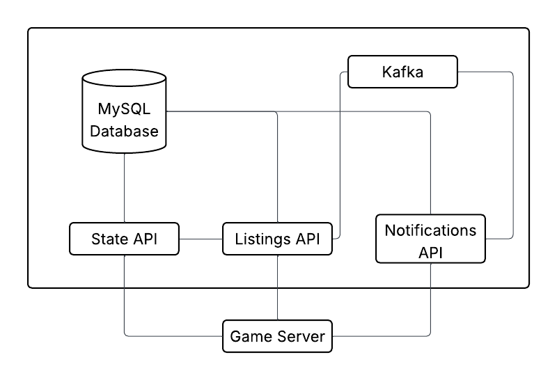

# game-marketplace
 Microservice based marketplace for a video-game. Consists of a Listings API which handles listing/purchasing and a separate Notifications API for notifying users of Listing creation.

# Functionalities
The functionalities of this project are as follows:
- Creation of users
- Creation of items
- Creation and retrieval of listings
- Creation of transactions
- Notifications for listings matching user criteria

# Technology
The technology stack of this project is as follows:
- Java 25 - language
- Spring Boot 4 - framework
- Gradle 10 - build software
- MySQL - database provider
- Kafka - messaging provider
- Docker - containerisation for deployment

# System Architecture

This project is intended for use by a game server. This server will query the APIs for the user.
The State API is used for creating items/users and handling the users wallet.
The Listings API interacts with the DB for creating and retrieving listings as well as retrieving item/user info.
The Notifications API has a DB entry for storing created notifications and will retrieve user info from the DB also.
The Listings API pushes a message to a kafka topic whenever a listing is created.
The Notifications API consumes these messages and sends out notifications to all users who have subscription criteria matching that listing.

# Database

